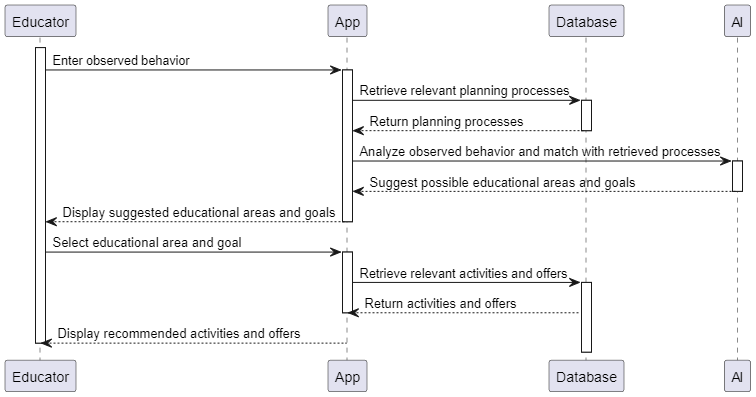
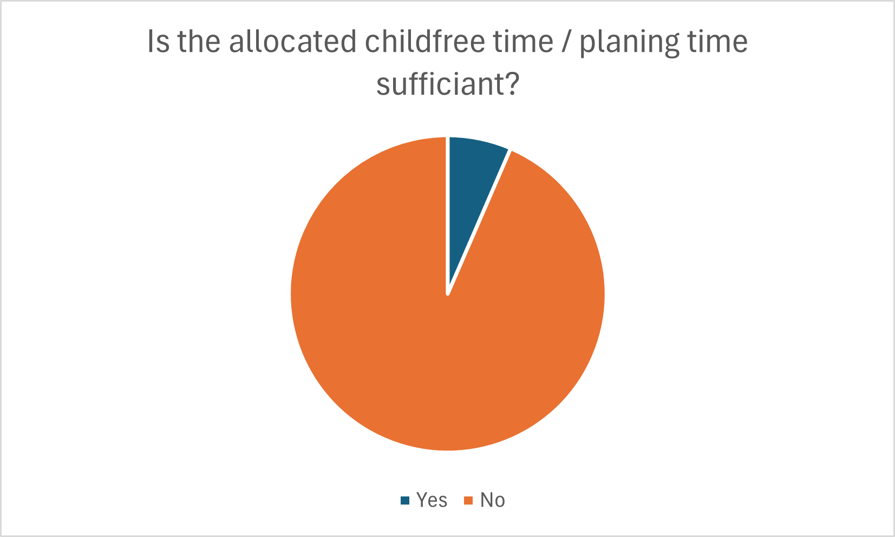
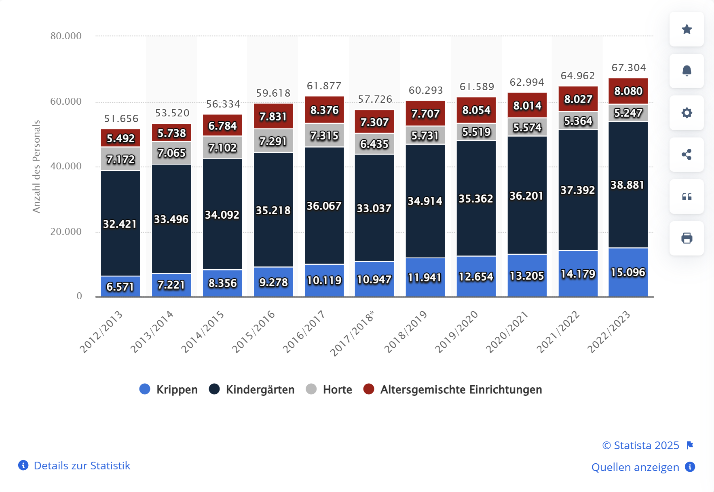
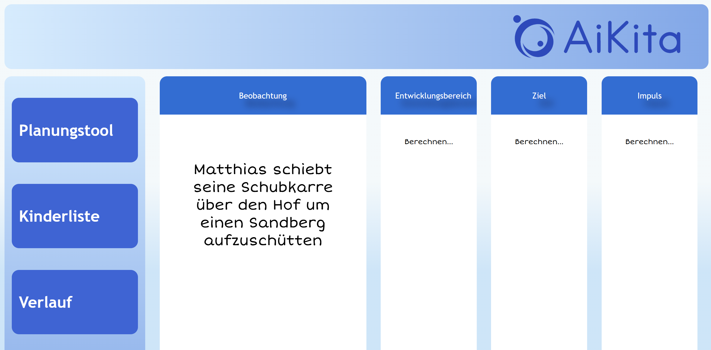

# AiKita

**Team members**
* Sarah Rio
* Ralph Mann
* Jürgen Huber

## Project Overview
This software is designed to support educators in planning educational 
processes based on children's behavior. By analysing observed behaviors with AI 
and suggesting matching educational areas, goals, and activities, this software sets itself 
apart from any other planning software currently available on the market for 
the pedagogical sector

### How AiKita supports educators during the pedagogical planning process
 
    

## Objectives

Our software is designed to actively support educators in their daily work in kindergarten. 
It aims to address the most important core tasks of educators: recording children's behaviour 
and planning targeted pedagogical impulses. 

This project offers a **secure, AI-driven platform** tailored for early childhood education. By integrating **local data collection** (via Python + PyQt) with a **scalable cloud backend** (Django, Celery, SQL/NoSQL databases), the solution empowers educators and administrators to gather real-time insights, comply with **GDPR**, and adhere to **Austrian educational standards**.

## [Initial Situation](docs/InitialSituation.md)
Early childhood educators (ECE) are facing **increasing demands** that have left them stressed and resorting to use unpaid overtime to meet legal requirenments.

* Over 90 percent of kindergarten teachers state that the **group-work-free service time**, that pedagogical professionals have available to prepare educational work is **insufficient**.

* The **shortage of skilled educators** has lead to a growing number of unqualified personel leading kindergarten groups, who are taking on pedagogical tasks without sufficient training.

*Publication of AKH 2021 on working conditions in child education and care*

[More...](docs/InitialSituation.md)

## [Target Group](docs/TargetGroup.md)

This project focuses on early childhood educators working with children aged 3 to 6 in kindergarten settings. These professionals support learning through play-based and structured activities, monitor developmental milestones, document behavior, and create an environment that fosters growth.

[More...](docs/TargetGroup.md)

## [Market Analysis](docs/MarketAnalysis.md)

As of 2022, the global AI in education market was valued at $2.5 billion. With as many as 30 multi-million-dollar-funded AIED corporations, this figure is expected to reach $6 billion by 2025. In general, the use of digital tools for observing and documenting children's development is increasing worldwide in the early childhood sector.

* German speaking markets lack behind international development
* AI educational apps experience a boom
* Competitive pressure low in pedagogy planning niche. Expected to rise.

* 

[More...](docs/MarketAnalysis.md)

## [Planning](docs/Planning.md)
* The team plans weekly programming sessions until August, along with additional training in AI implementation. 
* Meetings will be held every two weeks on Microsoft Teams, with more frequent sessions as needed. 
* Progress will be tracked via the timeline, regularly documented, and reviewed weekly.
  
[More...](docs/Planning.md)

## [System Concepts](docs/SystemConcepts.md)

Our architecture is composed of distinct yet interconnected components:

1. **Local Client Application**
    
    - A Python/PyQt interface enabling secure **data entry**.
    - SQLCipher encrypts sensitive information at rest, ensuring local data protection.
    - Preliminary **anonymization** before transmitting data to the cloud.
2. **Cloud Backend (Django + Celery)**
    
    - Django REST Framework handles data reception and API requests.
    - Celery, paired with Redis or RabbitMQ, manages **background tasks** for AI processing and scheduling.
3. **AI Analysis and Vector Database**
    
    - Libraries such as **scikit-learn**, **TensorFlow**, or **PyTorch** generate insights and high-dimensional vector representations.
    - A specialized vector database (e.g., **Milvus**, **Qdrant**, or **Weaviate**) stores these vectors for **advanced similarity searches** and analytics.
4. **Administration and Monitoring**
    
    - Django’s built-in **Admin Interface** enables system configuration, data management, and user role assignments.
    - Logs and audit trails ensure transparency and simplify troubleshooting.

[More...](docs/SystemConcepts.md)

## [User Experience and Design Principles](docs/UserExperienceAndDesignPrinciples.md)

Our approach prioritizes **user-friendliness** and **accessibility**, featuring:

- **Intuitive UI & Guided Tutorials**: Clear navigation, context-sensitive help, and step-by-step onboarding.
- **Customizable Settings**: Adjustable fonts, contrast options, and language expansions to serve diverse user needs.
- **Inclusive Education**: Compatibility with assistive technologies, ensuring educators, parents, and staff with varying digital literacy levels can effectively use the software.

 

[More...](docs/UserExperienceAndDesignPrinciples.md)

## [Financial and Monetization Strategy](docs/FinancialAndMonetizationStrategy.md)

To ensure the project’s viability, we employ multiple revenue streams:

- **Tiered Subscriptions**  
    Monthly or annual plans (e.g., €10/month or €100/year) provide predictable income for ongoing maintenance.
- **Freemium Model**  
    A basic free tier fosters wide adoption, with paid upgrades offering advanced features.
- **Advertising and Sponsorships**  
    Banner ads and sponsored educational content from partner organizations generate additional revenue.
- **Budget Management**  
    By prioritizing core functionalities and using open-source solutions, we keep development costs under control and plan for long-term sustainability.

[More...](docs/FinancialAndMonetizationStrategy.md)

## [Constraints and Compliance](docs/ConstraintsAndCompliance.md)

Key constraints reflect the **technical, legal, and operational** environment:

- **Technical Constraints**  
    Browser-based compatibility, secure local installations, and robust encryption ensure smooth adoption and performance.
- **Data Protection**  
    Full GDPR/DSVGO compliance includes user consent, anonymized data handling, and transparent data storage.
- **Performance and Scalability**  
    The infrastructure is designed to handle increasing user numbers and large datasets with minimal slowdowns.
- **Time and Budget**  
    A 14-month roadmap with iterative testing ensures timely delivery, while resource allocation supports evolving requirements.

[More...](docs/ConstraintsAndCompliance.md)

## [Security](docs/SecurityTxt.md)

Security is integral at every stage:

- **Encryption & Anonymization**  
    SQLCipher protects data at rest, while TLS/HTTPS secures data in transit. Personally identifiable information is anonymized before cloud transmission.
- **Role-Based Access Control (RBAC)**  
    Limit system privileges to authorized personnel based on user roles, ensuring data integrity.
- **Regular Audits**  
    Periodic checks and updates to patch vulnerabilities, coupled with logging and monitoring for suspicious activities.
- **Incident Response**  
    A documented plan for data breaches or system failures ensures swift mitigation and regulatory compliance.

[More...](docs/SecurityTxt.md)

## [Opportunities and Risks](docs/RiskMitigation.md)
### Opportunities

--> Add here

### Risk Mitigation
We employ strategies to address common and project-specific risks:

- **Infrastructure Reliance**  
    Data-sparse communication techniques and local caching help mitigate issues from unstable client devices or network disruptions.
- **AI Bias**  
    Datasets are diversified and regularly audited to minimize biases in AI-driven insights.
- **Regulatory Shifts**  
    Continuous monitoring of GDPR changes and Austrian educational guidelines ensures ongoing compliance.
- **Contingency Planning**  
    Maintain robust backups, a disaster recovery protocol, and clear workflows for critical system updates.

[More...](docs/RiskMitigation.md)

## [Marketing](docs/Marketing.md)

We plan a **multi-pronged marketing strategy** to engage educational stakeholders:

- **Direct Outreach & Events**  
    Targeted mailings, trade fairs, and conferences to showcase the platform’s tangible benefits.
- **SEO & Social Media**  
    Enhanced visibility on Facebook, Instagram, and LinkedIn, supported by user testimonials once pilots are complete.
- **Expansion Plans**  
    Upcoming language support, new AI features, and expanded user training resources to grow adoption and foster long-term retention.

[More...](docs/Marketing.md)
