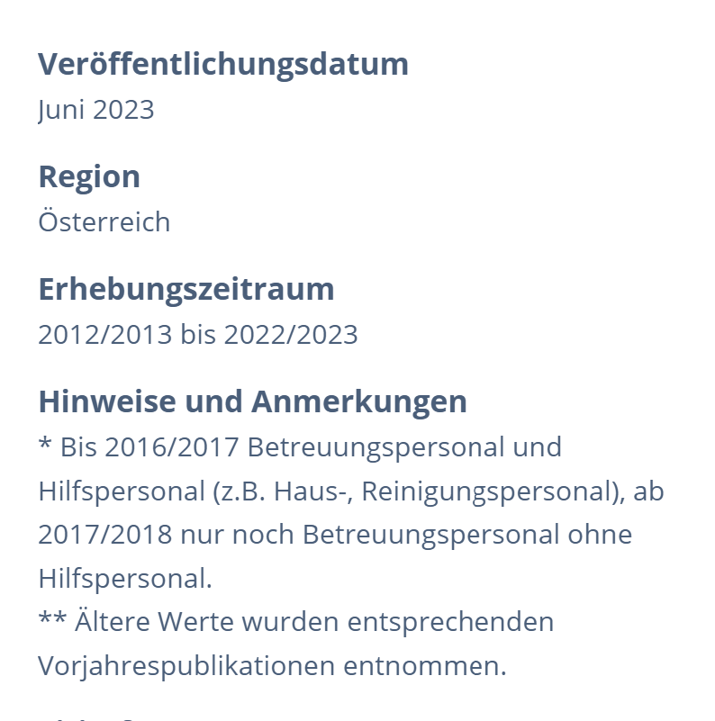

[Back to Main README](../README.md)
## Marketanalysis

The number of ECE's has been steadily growing in the past decade. Considering that most kindergarten and nursery schools are still understaffed, the numbers are predicted to rise even more. 

  
More on this statistics

  
  
  

There is a growing interest in digital tools for early childhood education, but the use of AI-powered software is still new.
Many kindergartens already use organizational software and online platforms for lesson plans, but there is a lack of AI-powered tools to support educators.
There are concerns about the cost of implementing new technologies and the potential for bias in AI algorithms.

The global AI in education market was worth £2.5 billion in 2022 and is expected to reach $6 billion by 2025.
Around two-fifths (44%) of children actively engage with generative AI, with more than half (54%) using it for schoolwork and/or homework.
Around half (51%) of teachers feel that the use of AI in education will have a positive impact, compared to just over a fifth (21%) who hold negative views.

More on AI development in early education

-----------
With the rising use of digital tools it seems only a question of time until they take foot in the educational sector. While already being in widespread use among teachers, they are still not popular amount early childhood educators in Austria and Germany. 

There are a growing number of pupplications that address the **advantages that the use of digital tools in education can offer**. Still there are **concerns** about how the use of AI might lead to **bias or discrimination**. A concern that requires proactive efforts to address and eliminate.

The analysis makes clear that digital methods of documentation are attractive in many respects: because of their intuitive operation, they can be integrated simply and efficiently into daily life in the early childhood centre; the various technical features are combined in such a way that they enable a clear overview of the documentation; they give children and parents opportunities to participate, and teachers who have an affinity with digital media often enjoy using them. All these advantages lead us to expect a rise in the quality of documentation work. Digital documentation appears to be a perfect form of documentation—a super-documentation.
*Knauf, Helen: Super-Documentation? Roads to Digitalisation of Documentation and their Implications. In: Alasuutari, M. ; Kelle, H. ; Knauf, H. (Hrsg.): Documentation in Institutional Contexts of Early Childhood. Normalisation, Participation and Professionalism. Wiesbaden : Springer Fachmedien, 2020, S. 241–255*

### Industry overview
Even though the use of computers in kindergarten institutions has already become the norm, the use of specific software for childhood education is still lacking compared to other countries. While there is wide array of organizational software for kindergarten and nursery schools as well as online platforms, that provide planned activities and ideas, there is so far none on the European market, that makes use of artificial intelligence to support the educational planning work.

In general, the use and dissemination of digital tools for observing and documenting children's development is increasing worldwide in the early childhood sector (Flewitt & Cowan 2019; Knauf 2020b; White et al. 2021). Stratigos and Fenech (2021) as well as Flewitt and Cowan (2019) each report a growing use and spread of such tools in Australia, New Zealand, the USA, Canada, and the United Kingdom.
*["Scheidt, A., Klein, C., Bempreiksz-Luthardt, J. 2022: Digitalisierung der KiTa. In: Dreyer, R. Hrsg.: Kita-Fachtexte, Nr. 4/2022. Berlin: Fröbel e. V."](https://nbn-resolving.org/urn:nbn:de:kobv:b1533-opus-5010)[fachtexte ](https://www.kita-fachtexte.de/de/fachtexte-finden/digitalisierung-der-kita.) [Zugriff am 31.01.2025.]*

---

 Interview on the reception of technology in Early Childhood Education

**The reception of technology in Early Childhood Education**

In an interview with experienced early childhood educator Ulrike Schwung, who has managed a large kindergarten and nursery school in Bad Schallerbach, Upper Austria, for twenty years, she emphasizes the growing need for more resources for educators. At her institution, weekly meetings are held where pedagogical staff discuss relevant topics and review learning materials, tools, and other resources.

The organizational software mandated by Caritas, the governing body of Kindergarten Bad Schallerbach, still leaves much to be desired. In recent years, however, they have started incorporating additional digital tools, such as the "Hallo Eltern" app. Developed by Education Group GmbH, this app is designed to facilitate communication between parents and teachers, replacing traditional paper-based notes with a digital and efficient solution. Despite its many advantages, it took three years for her team to fully implement the app. Older staff members, in particular, have struggled with adapting to new technology and have expressed reservations about "Hallo Eltern." Observing the developmental challenges in children stemming from excessive screen time at an early age, some remain hesitant to recognize the opportunities technology can provide when used responsibly. This reluctance, however, is not shared by younger educators, who have adapted to the app with ease.
Another concern she raises regarding the potential use of additional digital tools is the financial aspect. Many public kindergartens and nursery schools are underfunded and struggle to secure the resources they urgently need. While she has managed to obtain funding for training courses for her staff, justifying a subscription-based service to her superiors remains difficult. Comparing the €1,500 spent on a training course for Badok—an educational system for planning and documenting pedagogical work—with an online subscription to the platform ProKita for €15 per month, she notes that private institutions are far more willing to invest in one-time expenses. While the kindergarten does have a few subscriptions to magazines and online platforms for learning materials, these must be carefully weighed against their monthly budget for teaching resources.
*(Ulrike Schwung, personal interview, Bad Schallerbach, 01.31.2025)*

### Market Potential
The global AI in education market size was estimated at USD 5.88 billion in 2024 and is projected to grow at a CAGR of 31.2% from 2025 to 2030, driven by the increasing demand for personalized learning experiences.

### Europe AI In Education Market Trends
The Europe AI in education market is expected to witness at a significant CAGR over the forecast period. This growth is primarily driven by the increasing adoption of digital learning solutions and the push for personalized education across various European countries. Government initiatives, such as the European Commission's Digital Education Action Plan, are promoting the integration of AI technologies in schools and universities to enhance teaching and learning processes. In addition, the rising demand for intelligent tutoring systems and virtual learning environments is propelling investments in AI-driven educational tools.

*[AI In Education Market Size, Share & Trends Analysis Report By Component, By Deployment, By Technology (NLP, ML), By Application (Intelligent Tutoring System, Learning Platform & Virtual Facilitators), By End-use, By Region, And Segment Forecasts, 2025 - 2030](<https://www.grandviewresearch.com/industry-analysis/artificial-intelligence-ai-education-market-report>)* 

------------------

## Competitiv analysis
There are a growing number of AI supported educational apps that are all geared towards primary school education and ages up. However, there aren´t any that could offer the core function that our programs intends to implement on the European market yet. 

**LoveHeart**

In October 2024 an App called LoveHeart was published out of Australia. While their main function revolves around analysing a child's behaviour in form of a learning story, it does bare resemblance to our intended use. As it seems to be the only comparable program available to date, we will compare the LoveHearts Features to our intended features.
   | Feature | LoveHeart | Our Program |
|---|---|---|
| Input | Teachers describe the situation in a few key notes. They can choose the intended tone of the learning story and the story is generated by AI accordingly. | Teachers describe their observations in a few sentences. The original observation by the educator is never altered. |
| Analysis | LoveHeart offers a complete generated analysis on the documented behaviour, highlighting the key educational area. | The most likely educational areas are offered to the teacher to choose from. |
| Conclusion | Finally, a suggestion for the future is offered. It suggests where to go from there, what further activities to offer, and what to set your focus on in your educational offers. | After the teacher selects the educational area they deem most relevant to the situation, a set of goals is returned. When selecting a certain goal, a list of educational offers to further this goal is provided, including activities, innovative teaching methods, structured learning environments, and prepared materials to support the educator in achieving the set objectives. |

**Differences**

* Using KI for documenting saves time, but can't substitute teachers view
* KI can't interpret real life behaviour like qualified educators.
* Our program is designed to support educators not replace them.

More on the differences

While a timesaver, a generated story might differ greatly from the actual event. 
Saving time In documenting an occurrence might tempt early childhood educators to favour speed over accuracy. 
  
Children's behaviour can seldom be categorized into neat boxes. The interpretation is always up to the teacher, who has a deep knowledge of the child's interests and skills.

We hold the firm belief, that the relationship between the educator and the student is the driving factor from which future growth is facilitated. 
It is not possible to place the interpretation of a child's behaviour solely on a machine that has no real life interaction with the child.

While our goal is to develop a program that is capable of greatly aiding and enriching this process, our main goal is to assist qualified educators, not replace them.
LoveHearts program seems to be perfectly suited to document learning stories in a way that can be easily read and understood by parents and even children. 

This is where the key difference in our intended use seems to manifest. Our program is designed to cater primarily to educators and support them during the pedagogical planning process. Additionally LoveHeart is not adapted to the German speaking market. 

---
**Other AI educational apps on the market**
| **App**              | **Short Description** | **Use in Kindergarten Education** |
|----------------------|---------------------|----------------------------|
| **Education CoPilot** | AI-powered platform for lesson planning and educational content creation | Supports planning age-appropriate activities and teaching materials |
| **Teaching AI** | AI-driven tool for lesson preparation and student interaction | Creates personalized learning content for preschool children |
| **Auto Classmate** | AI-powered automation for teachers, including documentation and administration | Simplifies administrative tasks like attendance tracking and parent communication |
| **LessonsPlan.ai** | Automated creation and adaptation of lesson plans | Helps structure daily and weekly plans for kindergarten |
| **Curipod** | Interactive presentations and activities with AI support | Designs playful, interactive learning sessions for children |
| **Magic School** | AI-powered platform for creative teaching materials and activities | Generates stories, worksheets, and creative exercises for preschoolers |
| **Eduaide** | AI-assisted tool supporting teachers with resources and ideas | Provides suggestions for child-friendly learning games and activities |
| **Illumine** | Kindergarten management tool with features like reporting and parent communication | Documents child development and facilitates easy parent communication |

[Back to Main README](../README.md)
